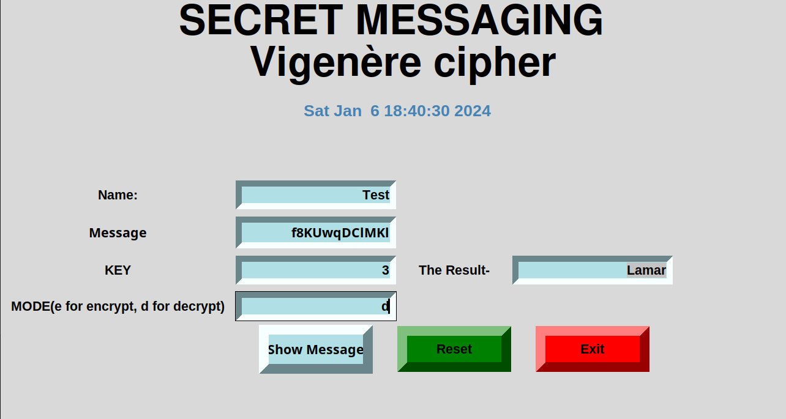

# Message Encryption and Decryption

This Python script implements a simple GUI-based application using the Tkinter library for message encryption and decryption using the Vigenère cipher. The Vigenère cipher is a method of encrypting alphabetic text by using a simple form of polyalphabetic substitution.

## Features

- **User-friendly Interface:** The graphical user interface provides a straightforward way for users to input information and interact with the application.

- **Encryption and Decryption:** The application allows users to encrypt and decrypt messages using the Vigenère cipher.

- **Input Validation:** The script includes basic input validation to handle empty fields or incorrect input formats.

## Requirements

The following Python modules are used in the script:

- Tkinter: For building the GUI.
- base64: For encoding and decoding messages.
- random, time, datetime: For various time-related functionalities.

## Usage



1. **Run the Script:**
   Execute the script using the following command:
   ```bash
   python one.py 
   ```
or
   ```bash
      python3 one.py 
   ```
2. **Enter Information:**
   - Provide a name in the "Name" field.
   - Enter the message in the "Message" field.
   - Input the encryption or decryption key in the "KEY" field.
   - Choose the mode ("e" for encrypt, "d" for decrypt).
   - Click the "Show Message" button to view the result.

3. **Reset and Exit:**
   - Use the "Reset" button to clear all fields.
   - Click "Exit" to close the application.

## Note

- The application uses the Vigenère cipher for encryption and decryption.
- Make sure to provide valid inputs for a seamless experience.
- For educational purposes only.

Feel free to customize and extend the script according to your needs.
